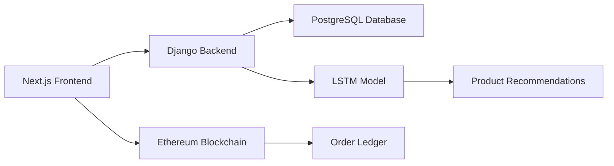

<div align="center">

# 🤖 Machine Learning & Deep Learning Laboratory 🧠


[](https://github.com/AtharvaLotankar11)
[](https://www.python.org/)
[](https://www.tensorflow.org/)
[](https://keras.io/)
[](https://scikit-learn.org/)

</div>

---

## 📚 Table of Contents

- [🎯 Overview](#-overview)
- [🔬 Machine Learning Experiments](#-machine-learning-experiments-1-6)
- [🧠 Deep Learning Experiments](#-deep-learning-experiments-7-10)
- [🚀 Mini Project](#-mini-project-experiment-11)
- [🛠️ Technologies Used](#️-technologies-used)
- [📊 Repository Structure](#-repository-structure)
- [🎓 Certifications](#-certifications)
- [👨‍💻 Author](#-author)

---

## 🎯 Overview

<div align="center">

```ascii
╔══════════════════════════════════════════════════════════════╗
║                                                              ║
║   A comprehensive collection of Machine Learning and        ║
║   Deep Learning experiments covering fundamental to         ║
║   advanced concepts with practical implementations          ║
║                                                              ║
╚══════════════════════════════════════════════════════════════╝
```

</div>

This repository contains a complete journey through **Machine Learning** and **Deep Learning** concepts, from basic regression models to advanced neural networks and real-world applications. Each experiment includes detailed Jupyter notebooks, comprehensive documentation, and practical implementations.

---

## 🔬 Machine Learning Experiments (1-6)

<div align="center">

### 📈 **Supervised Learning & Classical ML Algorithms**

</div>

<table>
<tr>
<td width="50%">

### 📊 Experiment 1: Linear & Logistic Regression
```python
🎯 Objective: Predictive Modeling
📌 Topics:
  • Simple & Multiple Linear Regression
  • Logistic Regression for Classification
  • Model Evaluation Metrics
  • Feature Engineering
```
**Key Concepts:** Gradient Descent, Cost Functions, R² Score

</td>
<td width="50%">

### 📉 Experiment 2: Advanced Regression Models
```python
🎯 Objective: Regularization Techniques
📌 Topics:
  • Multiple Regression Analysis
  • Lasso Regression (L1)
  • Ridge Regression (L2)
  • Elastic Net
```
**Key Concepts:** Overfitting Prevention, Feature Selection

</td>
</tr>

<tr>
<td width="50%">

### 🌳 Experiment 3: Decision Trees & Random Forest
```python
🎯 Objective: Ensemble Learning
📌 Topics:
  • Decision Tree Classifier
  • Random Forest Algorithm
  • Feature Importance
  • Bagging & Boosting
```
**Key Concepts:** Entropy, Gini Index, Tree Pruning

</td>
<td width="50%">

### 📍 Experiment 4: K-Nearest Neighbors (KNN)
```python
🎯 Objective: Instance-Based Learning
📌 Topics:
  • KNN Classification
  • Distance Metrics
  • Hyperparameter Tuning
  • Cross-Validation
```
**Key Concepts:** Euclidean Distance, K-Value Optimization

</td>
</tr>

<tr>
<td width="50%">

### 🤖 Experiment 5: Support Vector Machines
```python
🎯 Objective: Maximum Margin Classification
📌 Topics:
  • Linear SVM
  • Kernel Trick (RBF, Polynomial)
  • Support Vectors
  • Margin Optimization
```
**Key Concepts:** Hyperplanes, Kernel Functions, C Parameter

</td>
<td width="50%">

### 🧩 Experiment 6: Clustering Algorithms
```python
🎯 Objective: Unsupervised Learning
📌 Topics:
  • K-Means Clustering
  • Hierarchical Clustering
  • Dendrogram Analysis
  • Elbow Method
```
**Key Concepts:** Centroid-Based, Agglomerative, Silhouette Score

</td>
</tr>
</table>

---

## 🧠 Deep Learning Experiments (7-10)

<div align="center">

### 🔥 **Neural Networks & Advanced Architectures**

</div>

<table>
<tr>
<td width="50%">

### 🧠 Experiment 7: Artificial Neural Networks (ANN)
```python
🎯 Objective: Deep Learning Fundamentals
📌 Topics:
  • Feedforward Neural Networks
  • Backpropagation Algorithm
  • Activation Functions
  • Keras Implementation
```
**Key Concepts:** Perceptrons, Hidden Layers, Gradient Descent

**Technologies:** `Keras` `TensorFlow` `NumPy`

</td>
<td width="50%">

### 🖼️ Experiment 8: Convolutional Neural Networks
```python
🎯 Objective: Computer Vision
📌 Topics:
  • CNN Architecture
  • Convolutional Layers
  • Pooling Operations
  • Image Classification (MNIST)
```
**Key Concepts:** Filters, Feature Maps, Stride, Padding

**Technologies:** `Keras` `TensorFlow` `OpenCV`

</td>
</tr>

<tr>
<td width="50%">

### 📊 Experiment 9: RNN & LSTM Networks
```python
🎯 Objective: Sequential Data Processing
📌 Topics:
  • Recurrent Neural Networks
  • LSTM Architecture
  • Time Series Forecasting
  • Sequence Prediction
```
**Key Concepts:** Memory Cells, Gates, Temporal Dependencies

**Technologies:** `Keras` `TensorFlow` `Pandas`

</td>
<td width="50%">

### ✨ Experiment 10: Autoencoders
```python
🎯 Objective: Unsupervised Deep Learning
📌 Topics:
  • Encoder-Decoder Architecture
  • Image Denoising
  • Dimensionality Reduction
  • Feature Learning
```
**Key Concepts:** Latent Space, Reconstruction Loss

**Technologies:** `Keras` `TensorFlow` `Matplotlib`

</td>
</tr>
</table>

---

## 🚀 Mini Project (Experiment 11)

<div align="center">

# 🛒 **NexCart: AI-Powered E-Commerce Platform**


</div>

### 🎯 Project Overview

A comprehensive **full-stack e-commerce application** integrating **Machine Learning**, **Deep Learning**, and **Blockchain** technologies to create an intelligent shopping experience.

### 🏗️ Architecture



### 🔑 Key Features

<table>
<tr>
<td width="33%">

#### 🤖 **AI/ML Features**
- LSTM-based product recommendations
- User behavior analysis
- Personalized shopping experience
- Predictive analytics

</td>
<td width="33%">

#### ⛓️ **Blockchain Integration**
- Ethereum smart contracts
- Immutable order ledger
- Transparent transactions
- Sepolia testnet deployment

</td>
<td width="33%">

#### 🎨 **Full-Stack Features**
- Modern React/Next.js UI
- RESTful API architecture
- Real-time updates
- Secure authentication

</td>
</tr>
</table>

### 💻 Tech Stack

<div align="center">

**Frontend:** `Next.js` `React` `TailwindCSS` `Firebase`

**Backend:** `Django` `Django REST Framework` `PostgreSQL`

**ML/DL:** `TensorFlow` `Keras` `LSTM` `NumPy` `Pandas`

**Blockchain:** `Solidity` `Hardhat` `Ethers.js` `Alchemy`

**Payment:** `Razorpay` | **Email:** `Nodemailer` | **Security:** `reCAPTCHA`

</div>

### 📂 Project Structure

```
NexCart_Project/
├── frontend/          # Next.js application
├── backend/           # Django REST API
├── blockchain/        # Smart contracts & scripts
├── ml-model/          # LSTM recommendation engine
└── docs/              # Documentation
```

### 🔗 [View Full Project Documentation](./Experiment_11/NexCart_Project/README.md)

---

## 🛠️ Technologies Used

<div align="center">

### Programming Languages


### ML/DL Frameworks


### Web Technologies


### Blockchain & Tools


### Development Tools


</div>

---

## 📊 Repository Structure

```
Machine-Deep-Learning-Lab-Repo---Atharva-Lotankar/
│
├── 📁 Experiment_1/          # Linear & Logistic Regression
├── 📁 Experiment_2/          # Multiple, Lasso & Ridge Regression
├── 📁 Experiment_3/          # Decision Tree & Random Forest
├── 📁 Experiment_4/          # K-Nearest Neighbors
├── 📁 Experiment_5/          # Support Vector Machines
├── 📁 Experiment_6/          # K-Means & Hierarchical Clustering
├── 📁 Experiment_7/          # Artificial Neural Networks (Keras)
├── 📁 Experiment_8/          # Convolutional Neural Networks
├── 📁 Experiment_9/          # RNN & LSTM Time Series
├── 📁 Experiment_10/         # Autoencoders for Image Denoising
├── 📁 Experiment_11/         # NexCart Mini Project
│   └── 📁 NexCart_Project/
│       ├── frontend/         # Next.js application
│       ├── backend/          # Django REST API
│       ├── blockchain/       # Ethereum smart contracts
│       └── ml-model/         # LSTM recommendation system
│
├── 📁 MATLAB_Certi_Atharva_Lotankar/  # MATLAB Certifications
├── 📄 ML_DL Experiments 2025-26 Atharva Lotankar_31.pdf
└── 📄 README.md
```

---

## 🎓 Certifications

<div align="center">

### 🏆 MATLAB Machine Learning & Deep Learning Certifications

Completed comprehensive MATLAB training covering:
- Machine Learning Fundamentals
- Deep Learning Techniques
- Neural Network Design
- Model Optimization

📜 [View Certifications](./MATLAB_Certi_Atharva_Lotankar/)

</div>

---

## 📈 Learning Outcomes

<table>
<tr>
<td width="50%">

### 🎯 Machine Learning Skills
- ✅ Supervised & Unsupervised Learning
- ✅ Regression & Classification Algorithms
- ✅ Model Evaluation & Validation
- ✅ Feature Engineering
- ✅ Hyperparameter Tuning
- ✅ Ensemble Methods

</td>
<td width="50%">

### 🧠 Deep Learning Skills
- ✅ Neural Network Architectures
- ✅ Convolutional Neural Networks
- ✅ Recurrent Neural Networks
- ✅ LSTM & Time Series Analysis
- ✅ Autoencoders & Dimensionality Reduction
- ✅ Transfer Learning

</td>
</tr>
<tr>
<td width="50%">

### 💻 Development Skills
- ✅ Full-Stack Web Development
- ✅ RESTful API Design
- ✅ Database Management
- ✅ Version Control (Git)
- ✅ Cloud Deployment
- ✅ Agile Methodologies

</td>
<td width="50%">

### ⛓️ Emerging Technologies
- ✅ Blockchain Development
- ✅ Smart Contract Programming
- ✅ Ethereum & Web3
- ✅ Decentralized Applications
- ✅ AI/ML Integration
- ✅ Real-World Problem Solving

</td>
</tr>
</table>

---

## 🚀 Getting Started

### Prerequisites

```bash
# Python 3.8+
python --version

# Jupyter Notebook
pip install jupyter

# Required Libraries
pip install numpy pandas matplotlib seaborn scikit-learn tensorflow keras
```

### Running Experiments

```bash
# Clone the repository
git clone https://github.com/AtharvaLotankar11/Machine-Deep-Learning-Lab-Repo---Atharva-Lotankar.git

# Navigate to any experiment
cd Experiment_X

# Launch Jupyter Notebook
jupyter notebook
```

### Running NexCart Project

See detailed setup instructions in [NexCart Documentation](./Experiment_11/NexCart_Project/README.md)

---

## 📝 Documentation

Each experiment folder contains:
- 📓 **Jupyter Notebook** (.ipynb) - Interactive code and analysis
- 📄 **PDF Report** - Comprehensive documentation
- 📊 **Datasets** - Sample data for experiments
- 📸 **Visualizations** - Graphs and plots

---

## 🤝 Contributing

Contributions, issues, and feature requests are welcome! Feel free to check the [issues page](../../issues).

---

## 📧 Contact

<div align="center">

**Atharva Lotankar**

[](https://github.com/AtharvaLotankar11)
[](mailto:atharvalotankar11@gmail.com)
[](https://linkedin.com/in/atharva-lotankar)

</div>

---

## ⭐ Show Your Support

If you found this repository helpful, please consider giving it a ⭐!

---

## 📜 License

This project is open source and available for educational purposes.

---

<div align="center">

### 🎓 Academic Year 2025-26

**Machine Learning & Deep Learning Laboratory**

Made with ❤️ and lots of ☕


</div>
